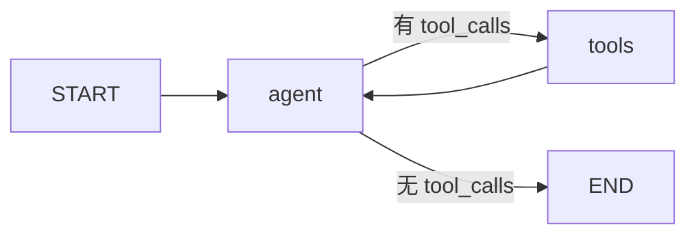

# LangGraph Agent 框架

基于 **LangChain + LangGraph** 的 ReAct Agent 脚手架，配合「智能体搭建助手」做**需求整理 → 方案讲解 → 同步实现**。

## 上传到 Git

一键脚本与详细步骤见 [`docs/git上传说明.md`](docs/git上传说明.md)。

```powershell
.\scripts\upload-to-git.ps1 -Remote "https://github.com/你的用户名/仓库名.git" -Message "首次提交"
.\scripts\upload-to-git.ps1 -Message "日常更新"
```

## 快速开始

### Conda 环境（推荐：`claudcode`）

```powershell
cd "e:\学习文件\研究生\就业\Agent学习\Claudcode"

# 一键创建/更新环境并安装依赖
.\scripts\setup_conda.ps1

# 或手动：
conda env update -f environment.yml --prune
conda activate claudcode

cp .env.example .env   # 首次：填入 API Key
python main.py --mode research
```

### pip 安装

```bash
pip install -r requirements.txt
cp .env.example .env
# 编辑 .env，填入 DEEPSEEK_API_KEY 或 OPENAI_API_KEY
python main.py
```

## 模式

| 命令 | 说明 |
|------|------|
| `python main.py --mode research` | **语音鉴伪多 Agent 研究**（默认读根目录 `input.md`） |
| `python main.py --mode research --continue --thread-id <id>` | **续问**：在上一轮方案基础上多轮对话 |
| `python main.py --mode research --human-review` | 定稿前人工审批 |
| `python main.py --list-sessions` | 列出已保存会话 |
| `python main.py --mode chat` | 通用单 Agent ReAct（同 thread_id 保留历史） |

研究工作流详见 [`docs/语音鉴伪研究工作流.md`](docs/语音鉴伪研究工作流.md)。

## 当前架构（通用 ReAct）



- **agent**：带工具的 LLM 推理（`nodes.py`）
- **tools**：执行 `tool_calls`（`tools.py` + LangGraph `ToolNode`）
- **状态**：`messages` 列表，自动累加（`state.py`）

## 编程式调用

```python
from langchain_core.messages import HumanMessage
from agent_framework import create_agent

app = create_agent()
result = app.invoke({"messages": [HumanMessage(content="现在几点？")]})
print(result["messages"][-1].content)
```

## 扩展新需求

1. 填写 [`specs/TEMPLATE.md`](specs/TEMPLATE.md) 或自然语言描述需求  
2. 阅读 [`docs/需求到实现.md`](docs/需求到实现.md) 了解协作流程  
3. 由助手选型并在 `agent_framework/` 内实现  

## 目录

| 路径 | 说明 |
|------|------|
| `agent_framework/` | 核心：图、节点、工具、配置 |
| `main.py` | 交互式 CLI |
| `docs/需求到实现.md` | 需求到实现的协作说明 |
| `学习借鉴/公司agent架构.md` | 外部 Agent 架构分析与借鉴笔记 |
| `.runs/` | 会话 Checkpointer 与阶段产物 Store（自动生成，已 gitignore） |
| `specs/` | 需求单模板 |
