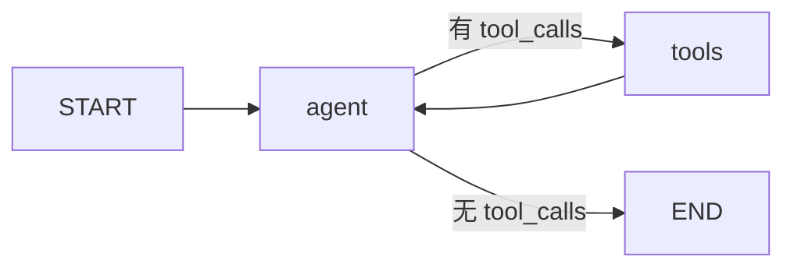

# LangGraph Agent 框架

基于 **LangChain + LangGraph** 的 ReAct Agent 脚手架，配合「智能体搭建助手」做**需求整理 → 方案讲解 → 同步实现**。

## 上传到 Git

一键脚本与详细步骤见 [`docs/git上传说明.md`](docs/git上传说明.md)。

```powershell
.\scripts\upload-to-git.ps1 -Remote "https://github.com/你的用户名/仓库名.git" -Message "首次提交"
.\scripts\upload-to-git.ps1 -Message "日常更新"
```

## 快速开始

```bash
pip install -r requirements.txt
cp .env.example .env
# 编辑 .env，填入 DEEPSEEK_API_KEY 或 OPENAI_API_KEY
python main.py
```

## 模式

| 命令 | 说明 |
|------|------|
| `python main.py --mode research` | **语音鉴伪多 Agent 研究**（主控 + 子 Agent + 检查） |
| `python main.py --mode chat` | 通用单 Agent ReAct |

研究工作流详见 [`docs/语音鉴伪研究工作流.md`](docs/语音鉴伪研究工作流.md)。

## 当前架构（通用 ReAct）



- **agent**：带工具的 LLM 推理（`nodes.py`）
- **tools**：执行 `tool_calls`（`tools.py` + LangGraph `ToolNode`）
- **状态**：`messages` 列表，自动累加（`state.py`）

## 编程式调用

```python
from langchain_core.messages import HumanMessage
from agent_framework import create_agent

app = create_agent()
result = app.invoke({"messages": [HumanMessage(content="现在几点？")]})
print(result["messages"][-1].content)
```

## 扩展新需求

1. 填写 [`specs/TEMPLATE.md`](specs/TEMPLATE.md) 或自然语言描述需求  
2. 阅读 [`docs/需求到实现.md`](docs/需求到实现.md) 了解协作流程  
3. 由助手选型并在 `agent_framework/` 内实现  

## 目录

| 路径 | 说明 |
|------|------|
| `agent_framework/` | 核心：图、节点、工具、配置 |
| `main.py` | 交互式 CLI |
| `docs/需求到实现.md` | 需求到实现的协作说明 |
| `specs/` | 需求单模板 |
