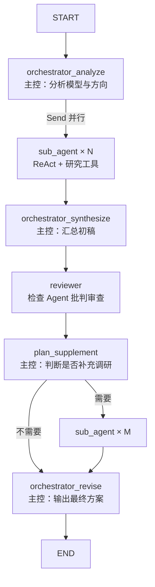

# 语音鉴伪多 Agent 研究工作流

## 需求整理

| 项 | 内容 |
|----|------|
| **领域** | 语音鉴伪（Anti-Spoofing），针对特定模型做性能调优 |
| **知识来源** | 互联网开源论文、代码库、评测报告 |
| **架构** | 在 ReAct 基础上改为**主控 + 多子 Agent + 检查 Agent** |
| **主控** | 分析目标模型 → 发现创新方向 → 分发任务 → 汇总 → 定稿 |
| **子 Agent** | 按方向 ReAct 调研（可调工具）→ 回报主控 |
| **检查 Agent** | 批判性审查初稿 → 意见作为二次输入 |
| **修订** | 主控根据审查修订；可按需再次调用子 Agent 补充调研 |

## 图结构



## 与基础 ReAct 的差异

| 基础 ReAct | 本工作流 |
|------------|----------|
| 单 Agent 循环 | 3 类角色、6 个图节点 |
| 状态仅 `messages` | `ResearchState`：方向、子任务结果、初稿、审查、终稿 |
| 通用工具 | 领域工具：知识库、开源检索、评测指标 |
| 一次对话结束 | 固定流水线 + 可选第二轮子 Agent |

## 代码位置

| 模块 | 路径 |
|------|------|
| 状态 | `agent_framework/research/state.py` |
| 提示词 | `agent_framework/research/prompts.py` |
| 工具 | `agent_framework/research/tools.py` |
| 节点 | `agent_framework/research/nodes.py` |
| 图 | `agent_framework/research/graph.py` |
| 入口 | `python main.py --mode research` |

## 论文 PDF 输入

支持将**论文原文 PDF** 作为参考材料：

| 方式 | 说明 |
|------|------|
| 放入目录 | 将 PDF 复制到 `data/papers/`，默认自动加载 |
| 命令行指定 | `--pdf path/to/paper.pdf`（可多次） |
| 子 Agent 深读 | 工具 `read_loaded_paper(文件名, section_hint)` 按关键词读段落 |

```bash
# 指定一篇论文 + 任务描述
python main.py --mode research \
  --pdf "data/papers/AASIST.pdf" \
  --task "基于该论文架构，在 LA 评测集上优化 EER"

# 仅加载显式 PDF，不扫描目录
python main.py --mode research --no-papers-dir --pdf ./my_paper.pdf --task "..."
```

**说明**：

- 使用 `pypdf` 提取文本；扫描版 PDF 无文字层时需先 OCR。
- 长文会截断注入主控的摘要，全文由子 Agent 通过工具分段读取。
- 请注意版权，仅上传你有权使用的论文。

## 运行

```bash
pip install -r requirements.txt
# 配置 .env 中的 DEEPSEEK_API_KEY 或 OPENAI_API_KEY

# 交互输入任务
python main.py --mode research

# 命令行一次性任务
python main.py --mode research --task "目标模型：AASIST，在 ASVspoof 2019 LA 上 EER=0.8%，希望结合 SSL 前端与 RawBoost 降至 0.5% 以下"
```

终稿写入 `output_final_plan.md`。

## 扩展建议

1. **子 Agent 数量**：在 `orchestrator_analyze` 的 prompt 中限制方向数（默认 2～4）
2. **真实文献 API**：将 `search_open_research` 换为 Semantic Scholar / arXiv API
3. **多轮审查**：在 `reviewer` 与 `orchestrator_revise` 间增加循环与 `revision_round` 上限
4. **持久化**：将 `sub_task_results` 写入 `reports/` 目录便于人工复核
