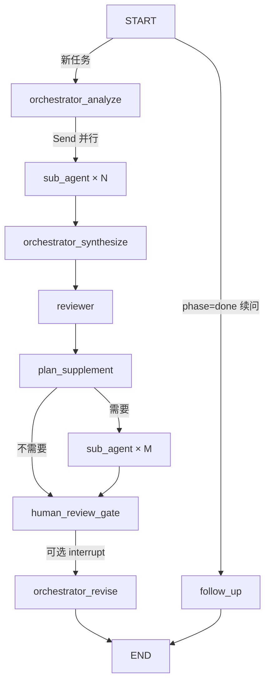

# 语音鉴伪多 Agent 研究工作流

## 需求整理

| 项 | 内容 |
|----|------|
| **领域** | 语音鉴伪（Anti-Spoofing），针对特定模型做性能调优 |
| **知识来源** | 互联网开源论文、代码库、评测报告 |
| **优化目标** | 降低 **ASVspoof 2021 LA / DF** 上的 **EER** |
| **跨域借鉴** | 图像 deepfake / 人脸反欺骗 → 语音鉴伪可迁移创新 |
| **架构** | 在 ReAct 基础上改为**主控 + 多子 Agent + 检查 Agent** |
| **主控** | 分析目标模型 → 发现创新方向 → 分发任务 → 汇总 → 定稿 |
| **子 Agent** | 按方向 ReAct 调研（可调工具）→ 回报主控 |
| **检查 Agent** | 批判性审查初稿 → 意见作为二次输入 |
| **修订** | 主控根据审查修订；可按需再次调用子 Agent 补充调研 |

## 图结构



## 与基础 ReAct 的差异

| 基础 ReAct | 本工作流 |
|------------|----------|
| 单 Agent 循环 | 3 类角色、6 个图节点 |
| 状态仅 `messages` | `ResearchState`：方向、子任务结果、初稿、审查、终稿 |
| 通用工具 | 领域工具：知识库、开源检索、评测指标 |
| 一次对话结束 | 固定流水线 + 可选第二轮子 Agent + **多轮续问** |

## 会话持久化与多轮续问（借鉴 Store / Checkpointer）

| 能力 | 实现 |
|------|------|
| **Checkpointer** | `SqliteSaver` → `.runs/checkpoints.sqlite`，`thread_id` 标识会话 |
| **文件 Store** | `.runs/store/{thread_id}/phase_outputs/`、`memory/` |
| **多轮续问** | 首轮 `phase=done` 后输入追问 → `follow_up` 节点更新 `final_plan` |
| **人工审批** | `--human-review` → `interrupt_before` 在 `human_review_gate` 暂停 |
| **进度事件** | 节点完成时打印 `[进度]`（`agent_framework/research/events.py`） |

```bash
# 首轮（记下输出的 thread_id）
python main.py --mode research --task "..." --human-review

# 同一会话续问（基于上一轮最终方案）
python main.py --mode research --continue --thread-id research-xxxxxxxxxxxx

# 列出最近会话
python main.py --list-sessions
```

## 代码位置

| 模块 | 路径 |
|------|------|
| 状态 | `agent_framework/research/state.py`（含 `phase_status` / `phase_artifacts`） |
| 会话 | `agent_framework/research/session.py` |
| Store | `agent_framework/research/store.py` |
| 提示词 | `agent_framework/research/prompts.py` |
| 工具 | `agent_framework/research/tools.py` |
| LLM 配置 | 根目录 `.env`；分角色 temperature 见 `agent_framework/config.py` |

### LLM 与 temperature

所有 Agent 共用同一 API/模型（`DEEPSEEK_*` 或 `OPENAI_*`），**temperature 按角色独立配置**：

| 环境变量 | 角色 | 默认值 |
|----------|------|--------|
| `ORCHESTRATOR_TEMPERATURE` | 主控（分析/汇总/修订/补充调度） | 0.2 |
| `SUB_AGENT_TEMPERATURE` | 子 Agent（ReAct 调研） | 0.1 |
| `REVIEWER_TEMPERATURE` | 检查 Agent | 0.1 |
| `LLM_TEMPERATURE` | 通用 `chat` 模式回退 | 0 |

### 研究工具一览

| 工具 | 用途 |
|------|------|
| `search_asvspoof2021_eer_research` | ASVspoof 2021 **LA/DF**、**EER**、anti-spoofing、deepfake 等多查询检索 |
| `search_deepfake_cross_domain` | **audio/image deepfake**、face anti-spoofing、可迁移语音鉴伪 |
| `search_open_research` | 通用检索（自动附加 ASVspoof / deepfake 关键词） |
| `query_antispoofing_knowledge` | 内置知识库（含跨域图像鉴伪条目） |
| `list_evaluation_metrics` | LA/DF EER 实验与报告规范 |
| `read_loaded_paper` | 本地论文 PDF 段落阅读 |
| 节点 | `agent_framework/research/nodes.py` |
| 图 | `agent_framework/research/graph.py` |
| 入口 | `python main.py --mode research` |

## 论文 PDF 输入

支持将**论文原文 PDF** 作为参考材料：

| 方式 | 说明 |
|------|------|
| 放入目录 | 将 PDF 复制到 `data/papers/`，默认自动加载 |
| 命令行指定 | `--pdf path/to/paper.pdf`（可多次） |
| 子 Agent 深读 | 工具 `read_loaded_paper(文件名, section_hint)` 按关键词读段落 |

```bash
# 指定一篇论文 + 任务描述
python main.py --mode research \
  --pdf "data/papers/AASIST.pdf" \
  --task "基于该论文架构，在 LA 评测集上优化 EER"

# 仅加载显式 PDF，不扫描目录
python main.py --mode research --no-papers-dir --pdf ./my_paper.pdf --task "..."
```

**说明**：

- 使用 `pypdf` 提取文本；扫描版 PDF 无文字层时需先 OCR。
- 长文会截断注入主控的摘要，全文由子 Agent 通过工具分段读取。
- 请注意版权，仅上传你有权使用的论文。

## 运行

```bash
pip install -r requirements.txt
# 配置 .env 中的 DEEPSEEK_API_KEY 或 OPENAI_API_KEY

# 推荐：编辑项目根目录 input.md 后运行（无需在终端粘贴长文本）
python main.py --mode research

# 命令行一次性任务
python main.py --mode research --task "目标模型：AASIST，在 ASVspoof 2019 LA 上 EER=0.8%，希望结合 SSL 前端与 RawBoost 降至 0.5% 以下"

# 定稿前人工审批 + 首轮结束后交互续问
python main.py --mode research --task "..." --human-review

# 仅续问已有会话
python main.py --mode research --continue --thread-id research-xxxxxxxxxxxx
```

终稿写入 `output_final_plan.md`（续问会话另存 `output_final_plan_{thread_id}.md`）。

### 输入文件 `input.md`

| 用途 | 说明 |
|------|------|
| 首轮任务 | 在 `input.md` 填写研究任务（HTML 注释 `<!-- -->` 会被忽略） |
| 续问 | 编辑同一文件后 `--continue --thread-id <id>`，或在首轮结束后的续问循环中保存文件 |
| 自定义路径 | `--input-file path/to/other.md` |

## 扩展建议

1. **子 Agent 数量**：在 `orchestrator_analyze` 的 prompt 中限制方向数（默认 2～4）
2. **真实文献 API**：将 `search_open_research` 换为 Semantic Scholar / arXiv API
3. **多轮审查**：在 `reviewer` 与 `orchestrator_revise` 间增加循环与 `revision_round` 上限
4. **持久化**：已实现 Checkpointer + `.runs/store/`；可将 `sub_task_results` 再导出到 `reports/`
